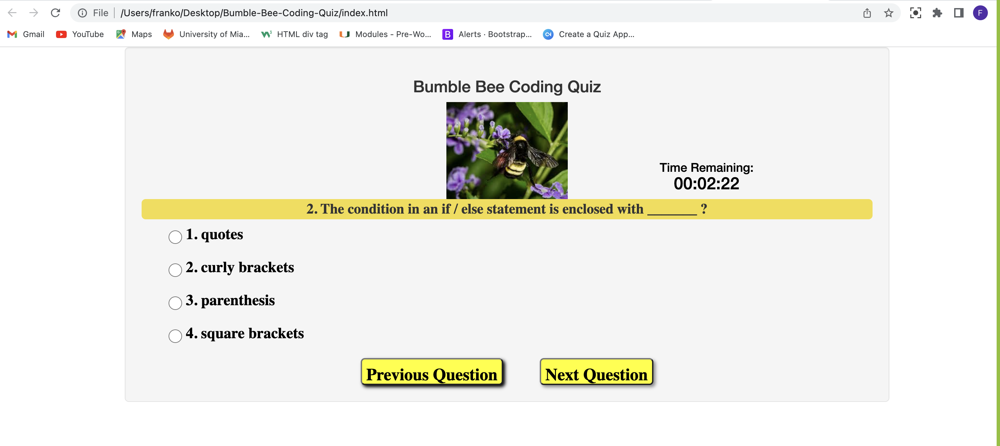

# Bumble-Bee-Coding-Quiz
Making a coding quiz to sharpen my javascript knowledge.  I am building a timed coding quiz with multiple-choice questions. This web app app will run in the browser, and will feature dynamically updated HTML and CSS powered by JavaScript code. It will have a clean, polished, and responsive user interface. This will help me to better undersanding a practical coding interview, specifically the coding test as part of a coding interview process used by tech companies such as Facebook, Google and Microsoft to attract the best technical talent.

The source code from this project was referenced from https://codepen.io/boopalan002/pen/yKZVGa , an open source quiz that was made available to the public. However, I have only used the code here as a starting point and made my own modification and changes based on my own understanding and appreciation of this open-source project.

URL:

Screenshot of Bumble Bee Coding Quiz:

